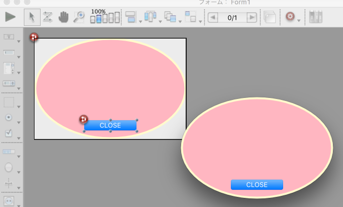

# 4d-plugin-custom-window
Set window transparent on Mac 64-bit

###Platform

| carbon | cocoa | win32 | win64 |
|:------:|:-----:|:---------:|:---------:|
|🆗|🆗|🚫|🚫|

###Version

 

###Syntax

```
SET WINDOW TRANSPARENT (window)
```

Parameter|Type|Description
------------|------|----
window|IN32|The window reference

###Example

```
If (Form event=On Load)
	SET WINDOW TRANSPARENT (Current form window)
End if 
```


